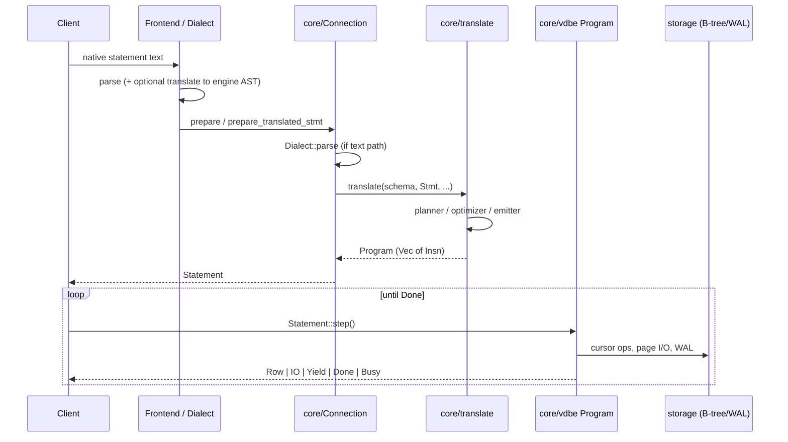

# Multi-Frontend Architecture Guide

> **Status as of 2026-07-21:** the graph sections of this guide predate the
> delivered graph frontend. Since it was written: the Ladybug/Kuzu donor
> suite was removed from the corpus (see `graph/CONFORMANCE.md`), the deep
> corpus grew to ~10k identities, `PreparedSource` + `FrontendCompiler`
> replaced the `ReprepareRecipe` naming, and variable-length traversal
> shipped as the `__turso_graph_expand` internal vtab. Where this guide and
> the code disagree, the code and `graph/test-results/REPORT.md` are
> authoritative.
>
> **Update (2026-07-21, later):** the public session API was subsequently
> simplified and renamed to today's `GraphConnection` type with
> `prepare`/`query`/`execute`/`Statement::result_types()`/`Parameters`, and
> the Postgres `graph.cypher()`/`install_graph` adapter described here was
> deliberately **removed** -- the Postgres and graph frontends are separate
> crates; apps compose them on one core connection via
> `Connection::register_frontend_compiler`. See `graph/README.md` for the
> current API and the exact old-name -> new-name mapping.

How Turso exposes database work as VDBE bytecode, how the SQLite and Postgres
frontends share one backend, and what it would take to add further frontends
(for example Neo4j/Cypher graph queries and a Kafka-style append-only log).

This guide is grounded in **this repository’s code**. Paths and traits below
are real extension points, not a greenfield multi-engine design.

Related existing docs (this guide complements them; it does not replace them):

- [`docs/manual.md`](manual.md) — prepare → translate → VDBE sequence diagram
- [`postgres/COMPAT.md`](../postgres/COMPAT.md) — Postgres frontend architecture and feature matrix
- [`postgres/cli/README.md`](../postgres/cli/README.md) — `tursopg` path (PG parse → Turso AST → bytecode)
- Root [`README.md`](../README.md) — “LLVM for databases” product framing

---

## 0. Feasibility verdict

The repository validates the **shared relational backend** thesis, but not yet
the stronger claim that arbitrary frontends can safely share one live database
without core work. PostgreSQL is compelling evidence for a second SQL-shaped
frontend; it is not evidence that graph traversal, Kafka broker semantics, or
per-session dialect state are already generic extension points.

| Proposal | Feasibility | What the code proves / what is missing |
|----------|-------------|-----------------------------------------|
| Add another SQL-like frontend on its own database | **High** | PostgreSQL provides a working parser, translator, `Dialect`, session, catalog, and wire-server pattern. |
| Add a relational Cypher subset over graph tables | **Delivered** | Fixed-length patterns lower to joins and DML; variable-length traversal now has a plan: the `__turso_graph_expand` internal vtab / `GraphExpand` IR operator (shipped, see §6). Recursive CTEs remain explicitly rejected in core `WITH RECURSIVE`; the graph frontend does not need them. |
| Add a Turso-backed topic API | **Medium** | Append/fetch/offset tables fit the VDBE and transactions. Durable offset allocation, wakeups/long polling, retention, and group coordination are product code. |
| Implement a Kafka-compatible broker | **Low without major work** | The Kafka protocol, record batches, group coordinator, replication/ISR, fetch sessions, and Kafka performance model do not exist in-tree. |
| Concurrent SQLite + PG + Cypher + Kafka sessions on one file | **Medium–high after prerequisites; unsupported today** | One `Database` owns one `Dialect`; parsing on reprepare, function resolution, schema formatting, and catalogs all use it. A host dialect alone does not provide safe per-session semantics. |
| Cypher with derived traversal acceleration | **Delivered** | Graph IR, `GraphExpand`, snapshot freshness, transaction-overlay, and resource-limit work landed on `feature/graph-frontend`; see §6 and `graph/README.md` / `graph/CONFORMANCE.md`. |
| Full Neo4j execution and compatibility characteristics | **Low without major work** | The selected path does not provide Neo4j's store, complete language/protocol surface, clustering, or operational behavior. |

The practical conclusion is:

1. **Proceed** with additional frontends when their first slice lowers to the
   shared engine AST and accepts Turso storage semantics.
2. **Prototype Cypher and topic APIs as session layers first**, using canonical
   SQL/engine AST and separate databases or a single SQLite-owned schema.
3. **Do not promise same-file polyglot isolation yet.** Make the frontend
   identity and reprepare path explicit, then add namespace enforcement and
   function/catalog dispatch before exposing concurrent protocols.
4. **Do not make direct VDBE emission the public frontend contract.** Although
   `ProgramBuilder` and `Insn` are public Rust types, constructing a correct
   program requires transaction, schema-cookie, cursor, async-I/O, trigger,
   reprepare, and statement-journal invariants currently owned by
   `core/translate`. Treat them as engine internals until a smaller supported
   plan/emitter API is designed.

### Blockers and removal paths

| Blocker | Evidence in this tree | Lowest-risk removal path |
|---------|-----------------------|--------------------------|
| One database-wide dialect | `Database::dialect`, `Connection::dialect`, `check_registry_dialect` | Keep one host dialect, but introduce an explicit `FrontendId`/compile context on prepare rather than inferring the frontend from SQL text. |
| ~~AST-only statements lose their frontend on reprepare~~ **RESOLVED** | `PreparedSource::Frontend { frontend, source }` plus `Connection::register_frontend_compiler` / `prepare_frontend` (`core/connection.rs`); `Statement::reprepare` re-dispatches through `compile_prepared_source` to the registered `FrontendCompiler`, so frontend identity survives reprepare | Shipped; no further work needed for this blocker. |
| Function semantics are database-wide | `Resolver::resolve_function` and `Insn::Function` execution call the database dialect | Canonicalize frontend functions to collision-free internal names, or pass a frontend-specific resolver/executor in the prepare context. Do not union ambiguous names silently. |
| No real same-file namespaces | Main has one `sqlite_schema`; PG `CREATE SCHEMA` uses `ATTACH` and extra files | Start with reserved physical-name prefixes plus an ownership table. Rewrite and validate names before core translation; later add a resolver-level namespace policy so every nested reference is covered. |
| Session-only checks are bypassable | Raw `Arc<Connection>` can prepare arbitrary SQL/AST | Keep the raw connection private to frontend sessions and the coordinator. For a security boundary, add authorization hooks in name resolution and DDL/DML compilation. |
| Schema ownership is incomplete | Only table DDL has dialect formatting hooks; views/triggers are stored and reloaded as canonical SQLite AST | Require each lowerer to produce canonical engine AST for non-table schema objects. Extend the dialect schema codec only if a frontend must preserve native text for those objects. |
| Recursive graph traversal via `WITH RECURSIVE` is absent (core SQL only) | `core/translate/planner.rs` rejects `with.recursive` | Not needed: the graph frontend's variable-length traversal ships as the `__turso_graph_expand` internal vtab / `GraphExpand` IR operator (§6), independent of core recursive CTEs. |
| Durable log offsets are not a rowid synonym | Rowid/AUTOINCREMENT behavior is SQL-oriented and gives no partition/offset semantics | Maintain `next_offset` per partition and allocate a batch range transactionally with the append. Test crash, rollback, concurrency, retention, and MVCC modes. |
| No on-disk dialect/host identity | The registry protects only live in-process opens | Use a canonical SQLite metadata table (and optionally `application_id`) validated before user-schema decoding. Do not change the SQLite file header layout. |

These prerequisites change the same-file estimate from the earlier “medium
product work” framing to **medium–high cross-cutting work**. They do not require
a second storage engine or a VDBE rewrite, but they do cross core prepare,
schema, resolution, and session boundaries.

---

## 1. Shared-backend model

Turso’s design intent (see README) is one modern engine core with many
frontends compiled onto it: SQLite first, Postgres second, others later.
The shared-backend multi-modal goal is a single storage/VDBE core with
multiple language and protocol frontends, not one database engine per modality.

At the code level that means:

| Layer | What it owns | Primary crates / modules |
|-------|--------------|---------------------------|
| **Wire / session** | Client protocol, connection lifecycle, statement batching | `cli/`, `postgres/server/`, bindings |
| **Frontend dialect** | Parse native text, catalog surface, functions, schema text encoding | `core/dialect/`, `postgres/frontend/`, `postgres/parser/` |
| **Engine AST** | Shared SQL-shaped IR (`turso_parser::ast`) | `sqlite/parser/` |
| **Codegen / planner** | AST → logical plan → bytecode program | `core/translate/` |
| **VDBE** | Register machine; `Insn` set; `step` | `core/vdbe/` |
| **Storage** | Pages, B-trees, WAL, pager, (optional) MVCC | `core/storage/`, `core/mvcc/` |

**Important invariant:** the durable backend is the SQLite-compatible file
format (B-trees + WAL) plus the VDBE. Frontends do **not** each own a separate
storage engine. They either:

1. lower native language into the **engine AST** and reuse SQL codegen (Postgres
   path today), or
2. could eventually emit a **validated engine plan** that core lowers to
   bytecode (prefer this over exposing raw `ProgramBuilder` / `Insn`), or
3. map domain concepts onto **tables, indexes, sequences, virtual tables** and
   still drive them through the same prepare/step API.

Dialects are fixed per open `Database` (not per connection): the process-wide
registry rejects opening the same file with a different `Dialect::name()` while
that instance is live (see `core/lib.rs` `check_registry_dialect`,
`core/dialect/mod.rs` tests). **Same file + multi-modal access is re-analyzed
in §8 under a namespace-isolated model** (each dialect owns a namespace; no
intermingled tables; cross-dialect work decomposes into single-ns ops inside
transactions).

---

## 2. How operations become bytecode

### 2.1 End-to-end path



Concrete entry points in this tree:

| Step | Location | Role |
|------|----------|------|
| Parse (dialect) | `Dialect::parse` in `core/dialect/mod.rs` | First statement → `turso_parser::ast::Cmd` + bytes consumed |
| SQLite parse | `core/dialect/sqlite.rs` → `turso_parser::parser::Parser` | Canonical SQLite text |
| Prepare | `Connection::prepare` / `prepare_with_origin` in `core/connection.rs` | Parse + compile |
| Frontend-supplied AST | `Connection::prepare_translated_stmt` | Skip dialect parse initially; reprepare still parses the retained input through the database dialect |
| Compile | `Connection::compile_cmd` → `translate::translate` | AST → `Program` |
| Codegen root | `core/translate/mod.rs` (`translate`, `translate_inner`) | Dispatches per `ast::Stmt` |
| Program shape | `core/vdbe/mod.rs` (`Program`, `PreparedProgram`) | Bound to a connection |
| Opcode set | `core/vdbe/insn.rs` (`enum Insn`) | Domain-specific DB opcodes |
| Interpreter | `core/vdbe/execute.rs` | Large step loop over instructions |
| Step API | `Statement::step` in `core/statement.rs` | Returns `StepResult` (Row / Done / IO / Yield / Busy / Interrupt) |

`docs/manual.md` still shows an older “Parser → translate” diagram; the live
boundary for multi-frontend work is **`Dialect` + `prepare_translated_stmt`**,
not “always go through the SQLite lemon-style parser.”

### 2.2 What bytecode looks like

The VDBE is a **register-based** machine whose instruction set is SQLite-family
(domain ops for tables, cursors, transactions, not a general-purpose CPU ISA).
Example from `docs/manual.md` / shell `EXPLAIN`:

```
addr  opcode       ...
0     Init
1     String8      ...  r[1]='hello, world'
2     ResultRow
3     Halt
4     Transaction
5     Goto
```

Representative storage-facing opcodes (names from `core/vdbe/insn.rs`):

- Control: `Init`, `Goto`, `Halt`, `ResultRow`, `Transaction`, `Jump`
- Cursors / B-trees: `OpenRead`, `OpenWrite`, `Rewind`, `Next`, `SeekGE`, `Insert`, `NewRowid`, …
- Indexes / sorters: `IdxInsert`, `SorterInsert`, …
- Virtual tables: `VUpdate`, `VNext`, …

Code generation builds these via `ProgramBuilder` (`core/vdbe/builder.rs`) from
translate modules (`select`, `insert`, `update`, `delete`, `schema`,
`sequence`, …).

### 2.3 The `Dialect` trait (engine ↔ frontend boundary)

Defined in `core/dialect/mod.rs`. Every `Database` carries one `Arc<dyn Dialect>`
for its lifetime. Responsibilities:

| Method | Purpose |
|--------|---------|
| `name()` | Stable id (`"sqlite"`, `"postgres"`, …); open-registry key |
| `parse(sql)` | Frontend text → engine `Cmd` (+ byte offset for multi-statement) |
| `parse_table_sql` / `parse_table_sql_ast` | Decode `sqlite_schema` row SQL into table definition |
| `format_table_sql` / `format_rewritten_table_sql` | Encode DDL into stored schema text (often with a frontend marker) |
| `table_sql_for_replay` | VACUUM / schema replay surface |
| `register_catalog` | Install dialect catalog virtual tables on every schema build |
| `resolve_function` / `exec_scalar_function` | Name surface + dialect-owned scalar execution (`Func::Dialect`) |
| `requires_custom_types` | e.g. Postgres forces custom-type machinery on |

**SQLite dialect** (`core/dialect/sqlite.rs`, `SqliteDialect`):

- Parse via `turso_parser` (in-tree SQLite grammar under `sqlite/parser/`)
- Store canonical SQLite `CREATE TABLE` text
- Register pragma TVFs, JSON virtual tables, etc. via `register_builtin_catalog`

**Internal helpers** always resolve functions with `SqliteDialect` semantics
(`translate::translate` sets the resolver dialect based on
`StatementOrigin::InternalHelper`), even on a Postgres-opened database.

For ordinary root statements, function resolution and dialect function
execution use the database-wide dialect. This is a material constraint for a
polyglot host: two frontends cannot give the same function spelling different
semantics unless the lowerers canonicalize those names or prepare carries a
frontend-specific resolver.

---

## 3. SQLite frontend ↔ backend

```text
Client / tursodb CLI / bindings
        │
        ▼
Connection::prepare(sql)
        │
        ▼
SqliteDialect::parse  ──►  turso_parser AST (Cmd/Stmt)
        │
        ▼
translate::translate  ──►  Program (Insn[])
        │
        ▼
Statement::step  ──►  B-tree / WAL / pager
```

| Component | Path | Notes |
|-----------|------|--------|
| Parser / AST | `sqlite/parser/` (`turso_parser`) | Lexer + recursive-descent; engine AST home |
| Dialect | `core/dialect/sqlite.rs` | Default for SQLite-compatible open paths |
| CLI | `cli/` (`tursodb`) | REPL, MCP, sync server; SQLite dialect |
| Codegen | `core/translate/*` | Full SQL surface the engine understands |
| Catalog | `sqlite_schema` + pragma_* / built-ins | No separate “pg_catalog” layer |

Bindings (`bindings/{rust,python,javascript,...}`) and the C API sit on
`Connection` / `Statement` with the SQLite dialect unless a frontend wraps them.

There is **no separate SQLite wire protocol server** in-tree analogous to
`postgres/server`; the SQLite “frontend” is primarily language + prepare API.

---

## 4. Postgres frontend ↔ backend

This is the **living second-frontend pattern**. Prefer copying its crate
layout and session flow when adding something new.

### 4.1 Components

| Crate / module | Role |
|----------------|------|
| `postgres/parser/` (`turso_pg_parser`) | `pg_query` (libpg_query) parse; `translator.rs` → engine AST |
| `postgres/frontend/` (`turso_pg`) | `PostgresDialect`, `PgConnection`, session, COPY, functions, catalog |
| `postgres/server/` | PostgreSQL wire protocol v3 (`pgwire`) over TCP |
| `postgres/cli/` (`tursopg`) | psql-like REPL; can host the server |
| `postgres/tests/` | Integration coverage for dialect, catalog, sequences, … |
| `postgres/COMPAT.md` | Feature matrix and architecture summary |

### 4.2 Statement path (preferred session path)

From `postgres/frontend/session.rs` (`prepare_statement`):

1. Optional special-cases: `COPY`, `CREATE/DROP SCHEMA`, `SET`/`SHOW`, matview refresh, …
2. `turso_pg_parser::parse(sql)` (full PostgreSQL grammar)
3. `PostgreSQLTranslator::translate_with_prereqs` → `ast::Stmt` (+ e.g. implicit `CREATE SEQUENCE` for `serial`)
4. Reject DML against emulated `pg_catalog` tables
5. Run prereqs then `conn.prepare_translated_stmt(stmt, original_sql)`
6. Same `translate` + VDBE as SQLite

`postgres/cli/README.md` states explicitly: **no SQLite text is generated** on
this path; translation targets Turso’s AST, then the normal bytecode pipeline.

### 4.3 `PostgresDialect` dual path

`PostgresDialect` in `postgres/frontend/catalog.rs` also implements
`Dialect::parse` for engine re-prepare and schema load:

- Try PG parse + translate; on failure fall back to **SQLite parse** (engine
  helpers / PRAGMAs are SQLite text)
- Persist user table DDL as
  `/* turso_frontend:postgres */ <original PG text>`
  (`STORED_PG_SCHEMA_PREFIX`) so schema reload re-parses through the PG
  translator
- Unmarked rows (e.g. `sqlite_sequence`) stay plain SQLite and use
  `BTreeTable::from_sql`
- `register_catalog` composes `sqlite::register_builtin_catalog` then installs
  `pg_*` virtual tables
- Functions: PG-specific names → `Func::Dialect` + `exec_scalar_function`; else
  compose `resolve_builtin_function`

Open path: `open_database` / `open_database_with_io` (`postgres/frontend/session.rs`)
pass `Arc::new(PostgresDialect)` into
`turso_core::Database::open(io, path, OpenOptions::new(dialect).storage(db_file).flags(flags).db_opts(opts))`.

### 4.4 Wire protocol

`postgres/server/lib.rs` (`TursoPgServer`) accepts TCP connections, runs
`pgwire` handlers, and executes through `PgConnection`. Simple and extended
query paths map to prepare/step and encode `Value` rows as Postgres data rows.

This layer is **orthogonal** to storage: any frontend can add a protocol server
without changing VDBE.

### 4.5 What “same backend” means for Postgres

- Same B-tree tables, indexes, WAL, pager, optional MVCC
- Same bytecode opcodes and translator modules
- Schema namespaces often map to **ATTACH**ed databases (`CREATE SCHEMA`)
- Catalog is **emulation** (virtual tables over real schema), not a second
  system catalog store
- Limitations are mostly in **translator coverage** and engine SQL surface
  (see `postgres/COMPAT.md`), not a separate storage fork

---

## 5. How to add a new frontend (checklist)

Use Postgres as the template. Minimum vertical slice:

1. **Crate layout** (mirror `postgres/`):
   - `parser/` — lexer/parser for the native language; own AST if needed
   - `frontend/` — session wrapper, `Dialect` impl, catalog/functions
   - optional `server/` — wire protocol
   - optional `cli/` — REPL
   - `tests/integration/` — real prepare/execute against core

2. **Implement `Dialect`** (required for open/schema):
   - Stable `name()`
   - `parse` or rely on session-only `prepare_translated_stmt` **and** still
     implement schema encode/decode if you store frontend DDL
   - Marker convention for `sqlite_schema.sql` (like `/* turso_frontend:postgres */`)
   - Always fall back to SQLite parsing for unmarked/internal rows
   - `register_catalog` for any system views clients expect
   - `resolve_function` / `exec_scalar_function` as needed

3. **Lowering strategy** (choose deliberately):

   | Strategy | When | Cost |
   |----------|------|------|
   | **A. Translate → engine AST** | Language is relational / SQL-like | Highest reuse of planner, EXPLAIN, indexes; limited by SQL AST expressiveness |
   | **B. Emit SQL text and `prepare`** | Quick prototype only | Fragile; loses fidelity; **not** what Postgres does |
   | **C. Add a core plan/operator lowered by core** | Ops that SQL cannot express cleanly | New planner/codegen path, but core retains bytecode invariants; recommended for traversal after an AST prototype |
   | **D. Direct `ProgramBuilder` / custom `Insn`** | Engine-internal experiment only | Public Rust visibility is not a stable or safe frontend boundary; caller must reproduce transaction, async-I/O, reprepare, and journaling invariants |
   | **E. Virtual tables / table-valued functions** | Catalog, streaming scans, foreign data | Good for read surfaces; writes via `VUpdate` |

4. **Session API**:
   - Wrap `Arc<Connection>`
   - Prefer `prepare_translated_stmt(engine_stmt, original_input)` after
     translation (preserves original text for schema + diagnostics)
   - For frontends that are not translated to engine AST up front, prefer
     `Connection::register_frontend_compiler` / `prepare_frontend` with a
     `PreparedSource::Frontend { frontend, source }`: the prepare context
     retains frontend id and source today, and `Statement::reprepare`
     re-dispatches through the registered `FrontendCompiler`, so identity
     survives reprepare without host-dialect source markers.
   - Keep the raw connection private if namespace ownership is meant to be an
     invariant rather than a convention.
   - Multi-statement split in the frontend (see `split_statements`)

5. **Open with your dialect** on every path that creates a `Database`
   (CLI, server, tests). Never mix dialects on one file unless all callers use
   the same deliberately designed host dialect and frontend-aware prepare path.

6. **Tests**: dialect unit tests in `core/dialect` style + frontend integration
   tests that open with your dialect and run end-to-end statements.

7. **Do not assume pure Dialect-only SQL translation is enough** if your
   language’s primary operations are not expressible as
   `SELECT`/`INSERT`/`UPDATE`/`DELETE` over tables. Section 6 and 7 spell out
   where Cypher and Kafka diverge.

---

## 6. Cypher / graph frontend (Neo4j-style)

> This section used to be a ~500-line implementation plan (M0–M9 milestones,
> D1–D5 checkpoints). That plan has been executed: the graph frontend shipped
> on `feature/graph-frontend`. The full historical plan, with its milestones
> annotated against what actually happened, now lives in
> [`docs/archive/multi-frontend-graph-plan.md`](archive/multi-frontend-graph-plan.md).
> This section is the current-state summary; Appendix A below (prior research)
> is unchanged supporting material.

### 6.1 What shipped

A Cypher graph frontend over ordinary Turso tables, as a Neo4j-style graph
query language compiled onto the shared backend — the crates
`turso_graph_cypher`, `turso_graph_ir`, `turso_graph_runtime`,
`turso_graph_frontend`, and `turso_graph_temporal` (see
[`graph/README.md`](../graph/README.md) for the crate dependency graph).

- **Session/prepare API:** `turso_graph_frontend::GraphConnection` (the crate
  root also re-exports it as `Connection`), with `prepare`/
  `prepare_cancellable` (returns a `Statement` wrapper exposing
  `result_types()`), `query`/`query_cancellable`, `execute` (returns a
  `MutationSummary`), `install`, and `open`/`open_with_parameters`. Free
  functions `open_database`/`open_database_with_io` open the underlying
  `turso_core::Database`. This API was renamed once after the archived plan
  below was written; see the status banner at the top of this document and
  `graph/README.md` for the mapping from the older names.
- **Fixed-length reads/writes** lower to the ordinary relational planner and
  VDBE, same as any other frontend.
- **Variable-length traversal** is a real operator, not a future item: the
  `__turso_graph_expand` internal table-valued scan
  (`graph/frontend/src/graph_expand.rs`) backs the `GraphExpand` IR operator
  (`graph/ir/src/plan.rs`) with a resumable, yield-safe cursor.
- **Conformance:** the latest recorded corpus run covers 10,242 identities
  with 8,800 passing (`graph/test-results/REPORT.md`); see
  [`graph/CONFORMANCE.md`](../graph/CONFORMANCE.md) for the contract and
  [`graph/DESIGN_DECISIONS.md`](../graph/DESIGN_DECISIONS.md) for design
  rationale.
- `core/translate/planner.rs` still rejects `WITH RECURSIVE` — that fact from
  the original plan is unchanged. The graph frontend does not need core
  recursive CTEs; `GraphExpand` is a separate, purpose-built traversal path.

### 6.2 Dialect alignment: two seams, mirroring Postgres

Both non-SQLite frontends now use the same two seams:

| Seam | Scope | PostgreSQL | Graph/Cypher |
|---|---|---|---|
| `Dialect` (per-database) | identity, schema rows, catalog vtabs, function surface | `PostgresDialect` (`postgres/frontend/catalog.rs`) | `GraphDialect` (`graph/frontend/src/dialect.rs`) |
| `FrontendCompiler` (per-connection) | statement compilation, prerequisites, reprepare | `PostgresCompiler` via `prepare_frontend("postgres")` | `GraphCompiler` via `prepare_frontend("graph-cypher")` |

Differences that remain by design: graph schema rows are unmarked SQLite
DDL (graph catalog state lives in `__turso_internal_graph_*` tables, not
in marked `sqlite_schema` text), and Cypher never enters `Dialect::parse`
— a Cypher statement on a raw connection gets an error pointing at
`GraphConnection`. The graph layer additionally supports attach mode on a
SQLite-dialect database, which pg does not.

### 6.3 Separation decision: no built-in Postgres graph adapter

A Postgres-facing `graph.cypher()` table function and
`PgConnection::install_graph` were built (commit `a7a22ff16`) and then
**deliberately removed** (commit `178437223`). `postgres/` has zero graph
dependency today, and the two frontends are separate crates in both
directions.

An application that wants Cypher and Postgres SQL on one connection composes
them itself, on one core connection, via
`Connection::register_frontend_compiler` / `Connection::prepare_frontend`
(`core/connection.rs`) — the same mechanism §0 and §5 describe for any new
frontend. There is no shipped `graph.*` SQL surface inside the Postgres
frontend, and none is planned as a default.

### 6.4 Where to look

| Topic | Reference |
|-------|-----------|
| Consumer usage guide (sessions, parameters, transactions, snapshots) | [`docs/graph.md`](graph.md) |
| Crate layout, quickstart, API shape | [`graph/README.md`](../graph/README.md) |
| Design rationale, Postgres-adapter removal | [`graph/DESIGN_DECISIONS.md`](../graph/DESIGN_DECISIONS.md) |
| Conformance contract and live numbers | [`graph/CONFORMANCE.md`](../graph/CONFORMANCE.md), `graph/test-results/REPORT.md` |
| Full original M0–M9 plan, annotated | [`docs/archive/multi-frontend-graph-plan.md`](archive/multi-frontend-graph-plan.md) |
| Superseded planning docs (delivery, type system, roadmap, etc.) | [`docs/archive/plans/`](archive/plans/) |

---

## Appendix A. Prior graph analysis and source inventory

> **Historical design appendix.** This appendix records the research that led
> to the original §6 implementation plan, now archived at
> [`docs/archive/multi-frontend-graph-plan.md`](archive/multi-frontend-graph-plan.md).
> It predates the delivered graph frontend and is kept as supporting research
> material, not a current design; where it conflicts with the shipped code,
> the code and `graph/README.md` win.

The remainder of this graph discussion records the research that led to the
plan above. It is supporting material, not an alternative implementation plan;
where it conflicts with the archived §6.2–6.10 plan, the archived plan wins
for historical purposes — neither should be read as a current design.

### A.1 Graph data model on this backend

The engine’s durable primitives are **rows in B-trees**, indexes, and
sequences—not native adjacency lists or relationship records with Neo4j’s
store format. A practical first model (property graph over tables):

```text
nodes(id INTEGER PRIMARY KEY, labels TEXT/JSON, props JSON/BLOB, ...)
relationships(
  id INTEGER PRIMARY KEY,
  start_id INTEGER NOT NULL,   -- FK / indexed
  end_id INTEGER NOT NULL,
  type TEXT NOT NULL,
  props JSON/BLOB,
  ...
)
-- Indexes: (start_id, type), (end_id, type), label/type lookup tables as needed
```

Optional refinements:

- Label/type side tables for set membership without scanning JSON
- Separate property tables (EAV) if wide/sparse properties dominate
- Use existing **JSON/JSONB** and array support in Turso for property maps
- Sequences (`core/translate/sequence.rs`, `nextval`) for node/rel ids

This is **relational encoding of a graph**, not a second storage engine.

### A.2 Earlier frontend-only ownership model

Use a **mixed-source frontend**, not a wholesale port of another graph
database. The reusable boundary is parsing and language semantics; Turso stays
authoritative below a small bound graph IR:

```text
Cypher source
    |
    v
Uni-derived parser + source AST
    |
    v
Turso-owned semantic binder
    |  scope, catalog ids, types, functions, parameters
    v
Turso-owned bound graph IR
    |                         |
    | fixed-length / CRUD     | variable-length / shortest path
    v                         v
Turso SQL AST             GraphExpand / path logical operator
    |                         |
    +------------+------------+
                 v
       Turso planner, VDBE, values, storage,
       transactions, WAL/MVCC, and async I/O
```

The seam has these non-negotiable ownership rules:

- The parser may retain Cypher-specific syntax and source spans, but no donor
  catalog, storage, execution, or physical-plan type crosses into Turso.
- The binder is new Turso code. It resolves variables, labels, relationship
  types, properties, functions, parameters, and clause scopes against a narrow
  Turso catalog interface.
- The bound graph IR contains resolved identifiers and Turso-owned values and
  expressions. It does not contain Uni `Value`, Grafeo common/schema types,
  Arrow batches, PostgreSQL parse nodes, or a donor database's record ids.
- Fixed-length patterns and relational operations lower to
  `turso_parser::ast` and use the existing planner and optimizer.
- Only operations that cannot be represented correctly in the current SQL AST
  enter core through a small logical operator, initially bounded graph expand.
- Frontends never assemble VDBE instructions directly. Core retains async I/O,
  yield/re-entry, transaction, statement-journal, and corruption invariants.
- Prepared input retains frontend identity, original source, and a reprepare
  recipe. Reprepare must not send Cypher text through the SQLite parser.

The initial graph IR should be deliberately small. A useful minimum operator
set is node scan, relationship expand, filter, project, aggregate, sort,
skip/limit, distinct, unwind, optional/left apply, union, create, merge, set,
remove, and delete. Add operators only when a conformance test cannot lower
correctly through the existing set.

### A.3 Source evaluation before pgGraph runtime selection

No single evaluated database provides the desired seam without also importing
its storage and execution assumptions. Use each source only where it is
strongest:

| Source | License | Use in Turso | Do not import |
|--------|---------|--------------|---------------|
| [Uni](https://github.com/rustic-ai/uni-db/tree/0812a496c62769b67cf688930750ae384e3de68d) | Apache-2.0 | Primary Cypher grammar, parser, source AST, source spans, and Rust TCK harness structure | `uni-query`, Arrow schemas/batches, Uni catalog, physical planner, executor, or storage |
| [Grafeo](https://github.com/GrafeoDB/grafeo/tree/4ebae02f06f8f0cbc57543f74b6ba06f259dbed3) | Apache-2.0 | Bound graph IR/operator taxonomy, binder organization, multi-language frontend separation, and selected optimizer ideas | Grafeo common values/schema, statistics/catalog implementation, physical planner, executor, or storage |
| [Apache AGE](https://github.com/apache/age/tree/6876abcab0a3281eb65a7e2a91238e0b5abfdea7) | Apache-2.0 | Semantic reference for lowering clauses onto a relational engine, especially `WITH`, `OPTIONAL MATCH`, joins, variable paths, and mutations | PostgreSQL parse state, `Query` nodes, range-table APIs, executor nodes, or a literal C-to-Rust port |
| [pgGraph](https://github.com/Evokoa/pgGraph/tree/d689bcf2b3b52d7f878f61718be69ebcb953affc) | Apache-2.0 | CSR construction, forward/reverse adjacency, bounded traversal, BFS/DFS, shortest/weighted paths, filters, resource limits, and portable tests | `pgrx` ABI, SPI, OIDs/`regclass`, GUCs, ACL/RLS, transaction callbacks, background workers, `$PGDATA`, sidecar assumptions, or its narrow Cypher wrapper |
| [Samyama](https://github.com/samyama-ai/samyama-graph/tree/4520154a65838d2e17a51b91882a99df816365c3) | Apache-2.0 | Later, evidence-driven ports of plan enumeration, cost modeling, leapfrog/WCOJ, semi-join, and adjacency-aggregate rules | Parser AST, graph store, physical operators, or optimizer rules before Turso has statistics and a stable graph IR |
| [SparrowDB](https://github.com/ryaker/SparrowDB/tree/82d85b7a861dfb2e127452ed89eebbcee74bfef0) | MIT | Secondary parser oracle and focused syntax/path/mutation regression tests | Its shallow binder or AST-driven execution engine |

This changes the role of the original shortlist:

1. **Uni is the direct code donor** for the source-language boundary.
2. **Grafeo is the architecture donor** for the bound graph IR, not a second
   parser to combine with Uni.
3. **AGE is an executable semantic specification**, not translation material.
4. **pgGraph is the traversal-runtime donor**, after extracting its portable
   Rust algorithms from PostgreSQL lifecycle and ABI dependencies.
5. **Samyama is a future optimizer donor** after profiling identifies a need.
6. **SparrowDB is a test and differential-parsing donor**, not the base
   frontend.

LLMs reduce mechanical conversion cost, including C/C++ to Rust, AST reshaping,
fixture conversion, and repetitive lowering code. They do not remove the hard
work: reconciling source semantics with Turso values, proving scope and null
behavior, defining traversal termination and path uniqueness, or preserving
transaction and reprepare invariants. LLM-translated code remains derived from
its source for license and attribution purposes.

#### A.3.1 Why pgGraph is extracted rather than installed

The inspected pgGraph revision is an alpha `pgrx` server extension. Its SQL
entrypoints and lifecycle depend on PostgreSQL facilities that Turso's
Postgres layer intentionally does not provide: extension loading, SPI, stable
server OIDs, `regclass`, GUCs, memory/error contexts, transaction and
subtransaction callbacks, background workers, `$PGDATA`, triggers, ACL/RLS,
and PostgreSQL compound types. Turso's Postgres support is a parser, translator,
catalog compatibility layer, session, and wire server over Turso core—not a
PostgreSQL backend ABI.

The useful boundary is below those entrypoints. pgGraph's pgrx-free parser,
plan/query, and engine areas contain a substantial portable test and algorithm
base, and its catalog snapshot abstraction demonstrates the adapter shape.
The selected implementation replaces catalog and row access with Turso traits,
treats CSR as derived state, and exposes it through shared graph services. The
current pgGraph Cypher wrapper is too narrow to replace Uni and is not the
language frontend.

### A.4 Earlier layer inventory

| Layer | What to build | Reuse |
|-------|---------------|--------|
| Lexer / parser | Cypher grammar → source AST with spans | Adapt Uni's `uni-cypher`; remove Uni values and extensions |
| Semantic analysis | Scope, variables, types, label/relationship/property resolution | New Turso-owned binder over a narrow graph catalog interface |
| Graph IR | Bound, frontend-independent graph operations | New Turso-owned IR, informed by Grafeo's logical plan |
| Relational lowering | Bound graph IR → engine AST | New; use AGE as a semantic reference, then normal Turso planning |
| Traversal lowering | Bound expand/path operations → core logical operator | New only for semantics the SQL AST cannot represent |
| Dialect | `CypherDialect` or hybrid SQL+Cypher open | `Dialect` trait pattern from Postgres |
| Catalog | Virtual tables or system tables for labels, rel types, constraints | `register_catalog`, `InternalVirtualTable` |
| Session | Delivered as `GraphConnection::{prepare, query, execute}` (not the `run(cypher)` sketch originally proposed here) | Mirrors `PgConnection` |
| Protocol (optional) | Bolt or HTTP | Like `postgres/server/` — thin over session |
| CLI (optional) | Cypher REPL | Like `tursopg` |

### A.5 Cypher construct mapping notes

| Cypher | Suggested lowering on Turso |
|--------|-----------------------------|
| `CREATE (n:Person {name:$n})` | `INSERT` into nodes + label index rows; return id |
| `MATCH (n:Person) WHERE n.name = $n` | `SELECT` with label predicate + property filter; indexes if present |
| `MATCH (a)-[r:KNOWS]->(b)` | Join `relationships` to `nodes` twice on start/end + type |
| `CREATE (a)-[:KNOWS]->(b)` | `INSERT` into relationships with FKs |
| `SET n.age = 42` / `DELETE` | `UPDATE`/`DELETE` on node or rel rows |
| `MERGE` | Transactional read-then-insert/update (engine tx) |
| Variable-length `[*1..5]` | **Not expressible through recursive CTE today** (`core/translate/planner.rs` rejects it). Start with a bounded iterative session/operator plan; add a core expand operator only after correctness and profiling work. |
| Shortest path / algorithms | Unlikely pure SQL; frontend orchestration or future graph-specific opcodes |
| Aggregations / `WITH` / `ORDER BY` | Map to SQL-like plan operators already in `translate/` |
| Parameters `$param` | Engine bind parameters (same as SQL prepared statements) |

### A.6 Superseded phase plan

This phase order predates the pgGraph runtime decision and is retained only to
show the earlier reasoning. The normative milestone order is §6.7.

Each phase has a boundary and an exit condition. Do not start by translating a
complete donor engine.

**Phase 0 — make prepared statements frontend-aware:**

- Add `FrontendId` and a reprepare recipe to prepared input/program state.
- Make initial prepare and schema-triggered reprepare use the same frontend
  compiler.
- Define collision-free internal names or a prepare-scoped resolver for Cypher
  functions.
- Exit when a prepared Cypher statement survives a schema version change
  without being reparsed as SQLite SQL.

**Phase 1 — parser, binder, graph catalog, and graph IR:**

- Adapt Uni's parser/AST into a focused frontend crate; remove Locy, Uni DDL,
  time-travel, plugin, Arrow, and storage dependencies.
- Implement the Turso-owned binder and graph IR. Use Grafeo's structure as a
  reference, not as a second runtime dependency.
- Store labels, relationship types, properties, and constraints in canonical
  Turso tables owned by the Cypher namespace.
- Exit when parser tests and the first read-only openCypher TCK slice produce
  stable bound plans without touching a donor executor.

**Phase 2 — fixed-length reads through Turso SQL planning:**

- Lower node scans, one- and multi-hop fixed patterns, filters, projection,
  aggregation, `WITH`, `OPTIONAL MATCH`, `UNWIND`, sort, skip, and limit.
- Follow AGE's transformation rules where clause placement affects semantics;
  for example, an `OPTIONAL MATCH` predicate belongs in the left-join condition,
  not a post-join filter.
- Use ordinary indexes on label/type and relationship endpoints.
- Exit when the selected read-only TCK slice, AGE lowering regressions, and
  Grafeo fixed-pattern tests pass through the normal Turso planner and VDBE.

**Phase 3 — mutations and transactions:**

- Add `CREATE`, `SET`, `REMOVE`, `DELETE`/`DETACH DELETE`, and then `MERGE`.
- Keep graph metadata and node/relationship mutations in one Turso transaction.
- Specify statement visibility, rollback, uniqueness, and missing-entity
  behavior with frontend tests; reuse Turso transaction machinery rather than
  donor WAL/MVCC code.
- Exit when mutation TCK cases and graph-specific rollback tests pass under the
  existing transaction modes.

**Phase 4 — bounded variable-length traversal:**

- Add one graph expand logical operator with explicit direction, relationship
  type set, lower/upper hop bounds, visited/path state, and deterministic result
  rules.
- Lower it in core to a resumable state machine that follows Turso's async I/O
  and yield/re-entry model.
- Add shortest-path/all-shortest-path operators only after expand correctness
  and profiling. Port Samyama optimization rules only when measurements show a
  concrete deficiency.
- Exit when openCypher path cases plus Ladybug, AGE, Grafeo, and Sparrow path
  regressions pass under deterministic and injected-yield testing.

**Phase 5 — protocol and product surface:**

- Add a thin HTTP/JSON API first; add Bolt only if client compatibility
  justifies its larger protocol and type-system surface.
- Add explicit multi-statement transaction behavior, cancellation, timeouts,
  auth, and namespace enforcement.
- Exit when the protocol is demonstrably a session adapter and contains no
  query planning or storage logic.

### A.7 Conformance and reusable test-source inventory

Tests are reusable independently of donor database code. Normalize them into a
frontend-neutral scenario form containing setup, query, expected columns/rows
or error category, side effects, ordering rules, and required feature tags.

| Source | License | Current useful material | Intended use |
|--------|---------|-------------------------|--------------|
| [openCypher TCK via Uni](https://github.com/rustic-ai/uni-db/tree/0812a496c62769b67cf688930750ae384e3de68d/crates/uni-tck) | Apache-2.0 | 221 feature files in the inspected snapshot; Uni supplies a Rust runner with result, error, and side-effect matching | Normative language conformance; import upstream feature files rather than forking Uni's copies indefinitely |
| [Ladybug tests](https://github.com/mwatts/ladybug/tree/7eab431c6becf64f58f7c2ff4c0fb1f160acb492/test/test_files) | MIT, with upstream attribution retained where applicable | 477 `.test` files, including 88 TCK-oriented files and focused shortest-path, recursive-join, optional-match, mutation, and error suites | High-value traversal and binder regressions; translate test intent, not C++ engine fixtures or storage behavior |
| [Apache AGE regressions](https://github.com/apache/age/tree/6876abcab0a3281eb65a7e2a91238e0b5abfdea7/regress/sql) | Apache-2.0 | 47 SQL scripts with thousands of embedded Cypher calls | Relational lowering, clause interaction, mutation, variable-path, shortest-path, and expected-error oracle |
| [Grafeo Cypher specs](https://github.com/GrafeoDB/grafeo/tree/4ebae02f06f8f0cbc57543f74b6ba06f259dbed3/tests/spec/lpg/cypher) | Apache-2.0 | 338 compact Cypher cases | Early feature-by-feature regressions before full TCK enablement |
| [SparrowDB integration tests](https://github.com/ryaker/SparrowDB/tree/82d85b7a861dfb2e127452ed89eebbcee74bfef0/crates/sparrowdb/tests) | MIT | Focused path, null, label, function, mutation, and historical regression cases | Secondary behavior oracle; its 17-scenario TCK-style file is not the upstream TCK |
| [CQLite tests](https://github.com/mwatts/cqlite/tree/e2b677e8429a4cb0ead087ffbd9195f4f3999819/tests) | MIT | 77 parser/integration tests in the inspected fork | Small smoke suite for binding errors, direction, parameters, matching, and basic mutations |
| Samyama tests | Apache-2.0 | Planner, join, aggregation, and execution unit/integration tests | Select optimizer invariants after equivalent graph IR operators exist |

Organize the Turso test pyramid as follows:

1. Parser/AST golden tests and parser fuzzing.
2. Binder scope, type, error-category, and bound-plan snapshots.
3. Lowering tests that compare the graph IR and resulting Turso AST/plan.
4. End-to-end curated regressions from Grafeo, AGE, SparrowDB, CQLite, and
   Ladybug.
5. The full upstream openCypher TCK, with unsupported scenarios reported rather
   than silently skipped and a hard failure when zero scenarios are discovered.
6. Deterministic traversal tests with yield/failure injection, cancellation,
   rollback, and abandoned-statement coverage.

Do not port donor storage, recovery, WAL, or general transaction tests when
they duplicate Turso coverage. Port only frontend-observable graph semantics
that Turso's existing SQL suites do not express.

### A.8 Licensing rules for mixed-source work

The six implementation references are compatible with Turso's MIT license:
Uni, Grafeo, pgGraph, Samyama, and Apache AGE are Apache-2.0; SparrowDB is MIT.
Ladybug and CQLite tests are MIT. Preserve copyright and license notices,
Apache NOTICE and patent terms, and any attribution carried by upstream
TCK-derived material.

LLM conversion does not launder provenance. Record the source repository,
pinned revision, source path, license, and whether a change is adapted,
translated, or behaviorally reimplemented. When practical, prefer a clean
Turso implementation from a documented semantic rule and test over a
line-for-line translation of a donor planner or executor.

Do not copy tests or code from GPL, AGPL, SSPL, or source-available graph
engines into the Turso tree. They may be used only as external behavioral
oracles unless legal review approves a different use.

### A.9 Earlier Cypher blocker inventory

| Blocker | Removal path |
|---------|--------------|
| Reprepare loses the originating frontend | Store `FrontendId`, original source, and frontend compile/reprepare recipe in prepared state |
| Database-wide function resolution | Normalize to collision-free internal functions or carry a prepare-scoped resolver |
| No graph catalog | Add canonical Turso tables plus a narrow binder-facing catalog interface; keep donor catalogs out |
| Recursive CTEs are rejected | Add bounded `GraphExpand` after fixed-length SQL lowering; do not make recursive CTE support a prerequisite |
| Cypher values differ from SQL values | Define conversions in the binder/lowering boundary and keep Turso `Value` authoritative |
| Path uniqueness and termination are underspecified | Encode walk/trail/path mode, hop bounds, and visited state explicitly in graph IR and tests |
| Multi-row graph mutations must be atomic | Compile them as one Turso statement/transaction plan and test rollback and re-entry |
| Same-file namespace access is not enforced | Complete the host-dialect ownership and authorization hooks described in section 8 before claiming isolation |

### A.10 What you do **not** get for free

- Neo4j disk format, clustering, or full Cypher compatibility matrix
- Constant-time relationship traversal as in a native graph store (you get
  indexed B-tree seeks; tune indexes)
- Graph-native locking or relationship-level MVCC beyond row-level engine rules
- `Dialect::parse` alone if Cypher is mixed with SQL in one connection without
  a clear multi-language dispatch rule
- Transparent reprepare of Cypher text passed to `prepare_translated_stmt`; the
  database dialect must be able to parse the retained input again

### A.11 Honest fit to “same backend”

**Good fit** if graph workloads can tolerate property-graph-on-tables and
leverage SQL indexes, JSON properties, and shared transactions with SQL/Postgres
frontends on the **same file** only when the dialect matches open policy
(today: one dialect per open database—plan multi-modal access carefully;
same process may open different files with different dialects, or you design a
future “polyglot” dialect that dispatches by statement kind).

**Poor fit** if the requirement is Neo4j-compatible store layout or heavy
OLAP graph algorithms without substantial new engine work.

---

## 7. Kafka-style append-only log frontend (topics)

### 7.1 Goal

A frontend that presents **topics / partitions / offsets / produce / consume**
semantics, while durability and indexing sit on Turso storage—so the same
codebase that serves SQL can also serve an append-only event log API.

### 7.2 Domain model → backend mapping

| Kafka concept | Suggested Turso mapping |
|---------------|-------------------------|
| Cluster / broker | Process hosting protocol server + one or more DB files |
| Topic | Logical name; metadata row in a control table |
| Partition | Table or table-partition key: e.g. `topic_T_p_N(offset INTEGER PRIMARY KEY, ts, key, value, headers)` |
| Offset | Explicit per-partition allocator (`next_offset`) updated in the same transaction as append; do not rely on incidental rowid allocation for the public contract |
| Produce (append) | `INSERT` only; reject `UPDATE`/`DELETE` of log records (or soft-delete via compaction policy) |
| Consume from offset | `SELECT ... WHERE offset >= ? ORDER BY offset LIMIT ?` with index on offset (PK) |
| Consumer group / committed offset | Side table `consumer_offsets(group_id, topic, partition, offset)` updated transactionally |
| Retention | Periodic `DELETE WHERE offset < watermark` or time-based purge job; not Kafka’s segment files |
| Compaction (log-compacted topic) | Upsert-by-key table or rebuild; different table shape than pure append log |
| ACLs / multi-tenant | Application layer; not in engine |

Example physical schema:

```sql
CREATE TABLE kafka_topics(
  name TEXT PRIMARY KEY,
  partitions INTEGER NOT NULL,
  config JSON
);

-- One table per partition (or a single table with (topic, partition, offset) PK)
CREATE TABLE log_orders_p0(
  offset INTEGER PRIMARY KEY,  -- allocated by partition metadata
  produce_ts INTEGER,
  msg_key BLOB,
  msg_value BLOB,
  headers JSON
);
```

Offsets should be allocated as a **range per produced batch** from durable
partition metadata and inserted in the same transaction. This makes the
ordering and rollback contract explicit. `INTEGER PRIMARY KEY` still provides
the storage index, but implicit rowid allocation is not sufficient evidence for
Kafka semantics: it gives no partition-scoped, gap-explicit offset contract,
so a purpose-built `next_offset` allocator should be the cross-mode design
foundation rather than `AUTOINCREMENT`.

### 7.3 Layers to implement

| Layer | What to build | Reuse |
|-------|---------------|--------|
| Metadata catalog | Topics, partition count, configs | Tables + optional virtual tables |
| Produce path | Validate topic/partition; append row(s); return base offset | `INSERT` codegen / `prepare_translated_stmt` |
| Fetch path | Read from offset with max bytes/count | `SELECT` + limit; session cursor state for long polls |
| Consumer groups | Commit/fetch offsets | Normal SQL tables + transactions |
| Wire protocol | Kafka protocol subset (or simpler custom TCP/HTTP) | New `server/` like `postgres/server/` |
| Dialect | Optional `KafkaDialect` if control plane is SQL-ish; often **session API only** with SQLite dialect underneath | Opening as `SqliteDialect` is valid if all DDL is SQLite |
| Admin API | Create/delete topic | DDL + metadata inserts |

Kafka’s wire protocol is large; a **pragmatic product** often implements a
minimal produce/fetch/offset-commit subset or a HTTP API first, same as
starting Postgres with a subset of COMPAT.

There is no commit-notification / partition-wakeup abstraction in the query
API today. A fetch query can read available rows, but efficient long polling
needs a broker-side waiter registry keyed by topic/partition and notified only
after the producing transaction commits. Polling the table is suitable for a
prototype, not for the steady-state design.

### 7.4 WAL vs “the log”

**Do not equate Turso WAL with Kafka topic log.**

| | Engine WAL (`core/storage/wal.rs`) | Topic log (application tables) |
|--|-----------------------------------|--------------------------------|
| Purpose | Durability / crash recovery for pages | User-visible event stream |
| Retention | Checkpointed away | Policy-driven, often long |
| Consumer API | None | First-class fetch by offset |
| Format | SQLite WAL frames | Your message layout |

Produce should still **commit** through normal transactions so WAL protects
topic tables. For multi-produce atomicity, use a single transaction wrapping
multiple inserts.

Optional later optimizations (not required for a first frontend):

- Append-optimized page patterns or dedicated “log segment” storage
- Dedicated opcodes for bulk append (avoid per-row SQL overhead)
- CDC (`capture_data_changes`) as a bridge from SQL tables **into** topics
  (engine already has CDC hooks; see dialect tests around `turso_cdc`)

### 7.5 Execution path

```text
Kafka client
    → protocol server (new)
    → LogSession
         produce: INSERT bytecode program(s) + commit
         fetch:   SELECT bytecode program + stream rows as records
         commit:  UPDATE consumer_offsets
    → same VDBE + B-tree + WAL
```

No Cypher/SQL parser is required for pure binary produce/fetch; the frontend
can build `ast::Stmt` values in Rust (or call a small internal SQL builder)
and use `prepare_translated_stmt`.

### 7.6 Semantics to define explicitly

- **Ordering:** per-partition total order via offset PK
- **Offset allocation:** reserve a contiguous batch range atomically with the
  append; specify whether failed/aborted batches leave gaps
- **Durability:** sync on commit vs batched commits (PRAGMA / journal mode)
- **Idempotent produce:** optional producer id + sequence table (Kafka feature)
- **Transactions (Kafka EOS):** map to engine transactions carefully; multi-partition
  atomic produce may need restricted scope or 2PC-like app logic
- **Retention/compaction workers:** background connections running DELETE/rebuild
- **Single writer vs MVCC:** concurrent producers are concurrent INSERTs; tune
  with WAL/MVCC modes as for SQL write workloads

### 7.7 Honest fit to “same backend”

**Good fit** for durable topics with SQL-joinable history, transactional offset
commits, and consolidating “events + relational + graph-on-tables” in one
binary and operational surface.

**Stretch** if you need Kafka-identical performance (sequential segment files,
zero-copy page cache, ISR replication). The guide’s backend mapping is a
**semantic** consolidation on Turso storage, not a drop-in Kafka broker.

**Blocker removal sequence:** prove a custom produce/fetch API first; add the
transactional allocator and post-commit waiter notifications; benchmark one
table versus one-table-per-partition; then decide whether Kafka wire
compatibility is valuable enough to implement record batches, compression,
CRC, metadata, group coordination, fetch sessions, idempotent producers, and
transactions. Replication/ISR remains a separate distributed-systems project.

---

## 8. Same file, multiple frontends: runtime complexity

### 8.0 Product model assumed in this section

Re-analysis under a **namespace-isolated multi-dialect** deployment model
(not free intermingling of every frontend’s tables):

| Rule | Meaning |
|------|---------|
| **One physical file** | Single SQLite-format DB file (one pager/WAL identity) holds all modalities. |
| **Dialect-owned namespaces** | Each dialect (SQLite, Postgres, Cypher, Kafka, …) stores objects only in a matching namespace. Tables are **not** shared or mixed across dialects. |
| **Scoped DDL/DML** | CREATE / UPDATE / INSERT / DELETE issued through a dialect session only touch that dialect’s namespace. |
| **Cross-dialect work is decomposed** | A statement that appears to span dialects is broken into **single-dialect** sub-operations (each maps to one namespace). |
| **Cross-dialect consistency = transactions** | Multi-namespace work runs inside an engine transaction so partial failure does not leave inconsistent multi-dialect state. |

This model **reduces** schema-intermingling risk (the hardest shared-table
problem) and **shifts** complexity into: (1) namespace enforcement, (2) a
coordinator that decomposes cross-dialect requests, (3) still living with
today’s **one live `Dialect` per open `Database`** engine rule.

The subsections below re-score complexity against **this** model and the
real code.

### 8.1 What the engine fixes today (still true)

```text
                    process-wide DATABASE_MANAGER
                              │  key = file identity (dev,ino)
                              ▼
                    ┌─────────────────────┐
                    │ Arc<Database>       │
                    │  dialect: Arc<dyn>  │  ← fixed at open, never mutated
                    │  schema: shared     │  ← loaded via that dialect
                    │  WAL / pager / …    │
                    └─────────┬───────────┘
                              │ connect() × N
                              ▼
                    all Connections share db.dialect()
```

| Object | Binding | Source |
|--------|---------|--------|
| `Database` | One `dialect` for life of open | `core/lib.rs` |
| `Connection` | Always `self.db.dialect()` | `core/connection.rs` |
| Schema load | `dialect.parse_table_sql` per `sqlite_schema` row | `core/schema.rs` |
| DDL store | `dialect.format_table_sql` | `core/translate/schema.rs` |
| Concurrent second dialect name on same file | **Rejected** | `check_registry_dialect` |
| On-disk dialect stamp | **None** (header has no dialect field) | `sqlite3_ondisk.rs` |

**Unchanged hard limit:** you cannot open the same path twice in-process with
`Dialect::name() = "sqlite"` and `"postgres"` concurrently. Namespace isolation
does not remove that registry check. Concurrent multi-modal access on one file
still requires **one open handle** (typically a **polyglot** or **host**
dialect that owns all namespaces).

### 8.2 Namespace isolation: how it maps to this tree

SQLite’s file format has **one** primary schema catalog
(`sqlite_schema` on page 1) for the main DB. True multi-schema in Postgres
frontend today is **not** same-file namespaces:

- `CREATE SCHEMA foo` → `ATTACH '…/turso-postgres-schema-foo.db' AS "foo"`
  (`postgres/frontend/session.rs` `handle_pg_create_schema`)
- That is **multiple physical files**, not one file with partitions

Under the **same physical file** product rule, dialect namespaces must be
implemented **inside** main (and optionally temp), for example:

| Mechanism | Same file? | Fit to engine today | Notes |
|-----------|------------|---------------------|--------|
| **Reserved name prefixes** e.g. `__ns_pg__t`, `__ns_kafka__orders_p0` | Yes | Works now | Session rewrites names; catalogs filter by prefix |
| **Single registry table** `turso_dialect_objects(dialect, name, kind, …)` + physical tables | Yes | Works now | Strong ownership metadata; still one `sqlite_schema` |
| **Markers in `sqlite_schema.sql`** (existing PG style `/* turso_frontend:postgres */`) **plus** namespace convention | Yes | Partially exists | Marker is per-table SQL text, not a full namespace system |
| **ATTACH per dialect** | **No** (extra files) | Exists for PG schemas | Violates “one physical file” unless you redefine the product |
| **Real multi-schema in one SQLite file** | Yes if built | **Not** first-class today | Would be significant storage/catalog work |

**Complexity of namespace isolation alone:** **medium for cooperative product
isolation; high for a security boundary**. Engine already allows many tables
in one file; it does **not** enforce “dialect A may not touch dialect B’s
tables.” A complete AST prewalk is difficult because references also occur in
subqueries, views, triggers, foreign keys, and generated expressions. The
lowest-risk MVP keeps the raw connection private and rewrites all names in each
frontend lowerer. Strong isolation needs a policy hook in core name resolution
and schema mutation.

### 8.3 What namespace isolation buys you (complexity down)

Compared to “all frontends share the same tables,” this model removes or
shrinks:

| Pain without isolation | With dialect-owned namespaces |
|------------------------|-------------------------------|
| Competing DDL on the same table from PG vs SQLite | **Gone** — each dialect owns its objects |
| One dialect’s `format_table_sql` rewriting another’s rows | **Avoided** if only the owning dialect writes that namespace’s schema rows |
| Catalog pollution (every table appears in every client catalog) | **Reduced** — each session’s catalog lists only its namespace |
| Type surface collisions on shared columns | **Reduced** — columns live under dialect-owned DDL |
| Function-name collisions | **Not removed** — root function resolution still uses the one database dialect |
| Accidental cross-language `UPDATE` | **Policy-forbidden**; coordinator never emits it |

Schema markers remain useful **inside** a namespace (e.g. PG-owned tables still
store `/* turso_frontend:postgres */ …`) so schema reload knows which parser
owns the row. A polyglot host dialect’s `parse_table_sql` can branch:

1. Detect marker / namespace → call that frontend’s decoder
2. Else SQLite fallback for engine internals (`sqlite_sequence`, etc.)

That is the same pattern already used inside `PostgresDialect::parse_table_sql`
(marker vs unmarked), generalized to N frontends.

**Complexity of multi-decoder table-schema load:** **medium** once ownership is
encoded. The marker/prefix must be readable from the schema row itself because
the ownership registry is another table whose schema also has to load. Views
and triggers currently reload through the SQLite parser, so their lowerers must
store canonical engine SQL or the schema codec surface must be expanded.

### 8.4 What stays hard (complexity that does not vanish)

#### (1) One live engine dialect name

Still required. Recommended shape under this product model:

```text
  SQLite session     PG session     Cypher session     Kafka session
        │                 │                │                  │
        │  each scoped to its namespace; session rejects out-of-ns names
        ▼                 ▼                ▼                  ▼
              Polyglot / host Dialect  (single Dialect::name)
              parse_table_sql dispatches by marker/namespace
        │
        ▼
  ONE Database → ONE file (WAL, pager, transactions)
```

Rival `Database::open` with different `Dialect::name` remains **forbidden**
while the first is live (`check_registry_dialect`).

The host also needs a **frontend-aware prepare/reprepare contract**. Initial
`prepare_translated_stmt` bypasses `Dialect::parse`, but
`Statement::reprepare` later reparses `program.sql` through the host dialect.
Without an explicit frontend id/reprepare recipe, schema changes can make a
previously valid Cypher- or API-originated statement fail only when stepped.

#### (2) Namespace enforcement (new product surface)

Must implement and test:

- CREATE only allowed with dialect’s namespace qualifier/prefix
- DML only against owned objects
- Catalog queries filtered to owned set
- Optional: deny raw `Connection` escape hatches that bypass the session

Without this, “isolation” is documentation only — any SQL session on the
shared open can still `INSERT` into another dialect’s tables.

**Complexity:** **medium** for private, cooperative sessions; **high** if this
is an engine-enforced ACL (no such permission model exists today).

#### (3) Cross-dialect decomposition coordinator

Assumed rule: **no native multi-dialect statement**. A user-level request that
needs data from more than one namespace is rewritten into ordered
single-dialect sub-statements.

```text
  Client: "graph hop then append event then SQL update"
       │
       ▼
  Coordinator (new layer — not in core today)
       │
       ├─► Cypher session: MATCH/UPDATE  (namespace cypher only)
       ├─► Kafka session:  produce          (namespace kafka only)
       └─► SQL session:    UPDATE …         (namespace sql only)
       │
       ▼
  BEGIN … sub-ops … COMMIT   on one Connection
```

| Coordinator concern | Complexity | Why |
|---------------------|------------|-----|
| Parse / plan cross-dialect request | Medium–high | New IR; not in VDBE |
| Map each piece to one namespace + one frontend lowerer | Medium | Per-frontend translators exist as patterns (PG) |
| Ordering and dependency (read then write) | Medium | App-level |
| Failure / rollback | **Low–medium** if one engine txn | `BEGIN`/`COMMIT` already spans all tables in the file |
| True distributed 2PC across processes/files | High | Out of scope if one file + one connection |

**Transactions for consistency (your rule):** on one `Connection` and one
file, a single `BEGIN` … multi-namespace DML … `COMMIT` is exactly what the
engine provides. All namespaces share the same WAL and transaction state.
That is a **major complexity win** versus multi-file ATTACH or multi-process
designs.

Caveats from real engine semantics:

- DDL often forces schema version bumps / reprepare; mixing heavy DDL across
  namespaces in one txn needs careful testing (same as multi-table DDL today).
- Nested / savepoint behavior is whatever Turso implements for SQL — the
  coordinator should prefer one flat transaction per cross-dialect request.
- Auto-commit mode would **violate** the consistency rule; coordinator must
  explicitly open a transaction for multi-op requests.
- Frontend APIs must separate planning from execution. The current PG
  `prepare_statement` may execute prerequisite statements (for example,
  translated sequence prerequisites) while preparing, so it is not yet a
  side-effect-free coordinator planning API.
- Isolation means there is no native cross-namespace join. The coordinator
  must materialize intermediate results and bind them into the next operation;
  large fan-out workflows may need a shared relational staging operator or a
  deliberately authorized cross-namespace plan.

#### (4) Schema reload still walks the whole `sqlite_schema`

Even with namespaces, open/reparse loads **all** table rows through
`parse_table_sql`. The host dialect must correctly decode **every** dialect’s
marked SQL. Wrong decoder ⇒ open failure or wrong table def for that
namespace only (isolation helps contain blast radius vs rewriting shared
tables, but open can still fail hard).

**Complexity:** **medium** — one multi-decoder path; good markers required.

#### (5) Catalogs and functions are database-wide unless explicitly mediated

`register_catalog` installs vtabls into the shared in-memory `Schema`. Options:

| Approach | Complexity | Note |
|----------|------------|------|
| Register **all** dialect catalogs (pg_*, graph_*, kafka_*) under host dialect | Medium | Names must not collide (`pg_class` vs future names) |
| Register only host builtins; each session fabricates catalog answers | Medium | PG already builds live `pg_*` from schema |
| Filter shared catalogs by namespace in vtab cursors | Medium | Cleanest for isolation story |

These catalogs are not naturally per-session: the host registers them into one
shared schema. Session wrappers can restrict which names are resolvable or
visible, but raw SQL can still see registered virtual tables unless core
authorization enforces the policy.

Function handling is stricter still. `Resolver::resolve_function` and
`exec_scalar_function` use the database dialect for every root statement,
including AST supplied by a frontend. A host can safely union only
non-conflicting spellings. For collisions, either lower to frontend-qualified
internal names or extend prepare/`Program` with a frontend-specific function
resolver and executor.

`PostgresDialect::requires_custom_types()` forcing custom types on the whole
DB is still a **global** open flag — namespace isolation does not give
per-namespace type machinery off/on. Accept global custom types if any
namespace needs them, or extend core later.

### 8.5 Engine primitives you reuse as-is

Under namespace isolation + transactional cross-dialect coordination:

| Need | Reuse |
|------|--------|
| Atomic multi-namespace write | Single connection transaction (`BEGIN`/`COMMIT`) |
| Durable one file | Existing WAL + pager |
| Per-namespace tables | Ordinary `CREATE TABLE` + naming/registry convention |
| Per-dialect DDL text | `format_table_sql` markers (PG pattern) generalized |
| Per-dialect initial compile | `prepare_translated_stmt` after frontend lower; reprepare needs the new frontend-aware contract |
| Concurrent clients | Multiple `Connection`s on one `Database` (same as today) |
| ATTACH multi-file schemas | **Avoid** for this product model (breaks one-file rule) |

### 8.6 Complexity matrix (under namespace isolation)

| Scenario | Supported / effort | Notes under this model |
|----------|--------------------|-------------------------|
| Single-dialect session, only its namespace | **Low–medium** | Private session + complete name rewrite; not an ACL |
| Many protocols, one host dialect open, isolated namespaces | **Medium–high** | Requires frontend-aware reprepare, schema codecs, catalogs, and function dispatch |
| Cross-dialect request → decomposed + one txn | **Medium–high** | Transaction is reusable; planning, side-effect ordering, and intermediate data flow are new |
| Concurrent second `Dialect::name` open on same file | **Still impossible** | Registry; use host dialect |
| Intermingled tables shared by dialects | **Out of model** | Explicitly not required; simplifies design |
| PG-style `CREATE SCHEMA` as separate files | **Wrong tool** for one-file goal | Existing code uses ATTACH files |
| Cross-dialect join as one VDBE program | **Not assumed** | Decompose instead; optional later optimization |
| Multi-process different host dialects | **Still unsafe** | No durable host metadata validation |

**Bottom line under these assumptions:**
Overall feasibility is **medium–high cross-cutting work**, not merely a medium
coordinator project. A second storage engine and dual concurrent dialect opens
are unnecessary, but the host design must change prepare/reprepare context,
name enforcement, function dispatch, schema decoding, and catalog visibility.

### 8.7 Recommended architecture (namespace-isolated, one file)

```text
                         ┌─────────────────────────────┐
                         │  Cross-dialect coordinator  │
                         │  (decompose → single-ns ops)  │
                         │  BEGIN ………… COMMIT         │
                         └─────────────┬───────────────┘
               ┌───────────────┬───────┴────┬────────────────┐
               ▼               ▼            ▼                ▼
          SQL session     PG session   Cypher session   Kafka session
          ns=sql          ns=pg        ns=cypher        ns=kafka
               │               │            │                │
               └───────────────┴─────┬──────┴────────────────┘
                                     ▼
                    Host Dialect (one Dialect::name)
                    frontend-aware prepare / reprepare
                    parse_table_sql by marker/namespace
                    collision-safe function + catalog dispatch
                                     ▼
                    ONE Database / ONE .db file
                    tables only in their dialect namespace
                    shared VDBE + WAL + transactions
```

**Do this:**

1. Add an explicit **frontend identity and reprepare recipe** to prepared
   statements (or use an unambiguous source marker as a prototype).
2. **One physical file, one open `Database`, one host dialect name.**
3. **Encode ownership** on every user object (prefix and/or
   `turso_dialect_objects` + SQL markers for DDL text).
4. **Sessions enforce scope:** creates/updates only in matching namespace;
   catalogs only list owned objects.
5. **Canonicalize function names** or carry a per-frontend resolver; reject
   collisions rather than choosing one dialect's semantics.
6. **Cross-dialect API** always: decompose → single-dialect lowers →
   `prepare_translated_stmt` / step → wrap multi-step work in **one**
   transaction.
7. **Generalize PG markers** so each namespace’s `sqlite_schema.sql` is only
   decoded by its owner during host `parse_table_sql`.
8. **Do not** use multi-file `ATTACH` schemas for dialect isolation if the
   product requires a single file (that is today’s PG `CREATE SCHEMA` path).

**Do not do this:**

1. Dual `Database::open` with different dialect names on the same path.
2. Rely on clients to “just not touch” other namespaces without session
   enforcement.
3. Auto-commit a multi-namespace workflow.
4. Assume an initially translated AST bypasses the host dialect during later
   statement reprepare.
5. Union colliding function names or catalogs without a frontend context.

### 8.8 Effort sketch (this model)

| Work item | Purpose | Rough effort |
|-----------|---------|--------------|
| Frontend id + reprepare recipe in prepare/program | Preserve semantics after schema/config changes | Medium–high |
| Namespace convention + ownership registry | Isolation metadata | Low–medium |
| Private session name rewrite | Cooperative isolation MVP | Medium |
| Resolver/schema authorization hooks | Engine-enforced isolation | High |
| Host/polyglot `Dialect` multi-decoder | Load all namespaces’ schema SQL | Medium |
| Function/catalog collision strategy | Preserve per-frontend semantics | Medium–high |
| Per-frontend lowerers (Cypher, Kafka, …) | Single-ns execution | Medium each (PG is template) |
| Side-effect-free plans + coordinator | Decompose + consistency | Medium–high |
| Engine dual concurrent `Dialect::name` | Not needed under this model | **Avoid** |
| On-disk host metadata validation | Safer sequential/multiprocess reopen | Medium |

### 8.9 Residual engine facts (unchanged by the product model)

These remain true regardless of namespace policy:

- `check_registry_dialect` rejects concurrent dialect-name mismatch
- Dialect is not stored durably; use SQLite-compatible metadata rather than a
  header-layout change
- `Connection` cannot hot-swap dialect
- ATTACH targets inherit the attaching connection’s dialect
- Internal helpers still resolve functions with SQLite semantics
- Multiprocess dialect mismatch is not registry-protected

Cooperative namespace isolation can be layered above those facts. Durable,
engine-enforced isolation and correct per-frontend reprepare require targeted
core extensions, but still do not require rewriting the VDBE.

---

## 9. Consolidating multi-modal access

### 9.1 What works today

```text
                 ┌─────────────┐  ┌──────────────┐
                 │  SQLite SQL │  │ Postgres SQL │
                 │  + bindings │  │ + wire (pg)  │
                 └──────┬──────┘  └──────┬───────┘
                        │                │
                        ▼                ▼
                 Dialect::parse / prepare_translated_stmt
                        │
                        ▼
                 engine AST (turso_parser::ast)
                        │
                        ▼
                 core/translate → VDBE Insn program
                        │
                        ▼
                 B-tree / WAL / pager / MVCC
```

One **core**, two **SQL-shaped** frontends. Under the **namespace-isolated**
target model (§8.0), dialects do not intermingle user tables; cross-dialect
work is decomposed and transactional. Concurrent different
`Dialect::name()` opens on one file still fail the registry. One host dialect
is necessary for the target model, but it becomes sufficient only after the
frontend-aware prepare/reprepare, resolution, and ownership work in §0 and §8.

### 9.2 Target multi-frontend shape

```text
  SQLite     Postgres     Cypher        Kafka API
  session    session      session       session
  (ns=sql)   (ns=pg)      (ns=cypher)   (ns=kafka)
      \          |          |             /
       \         |          |            /
        ▼        ▼          ▼           ▼
     [ optional cross-dialect coordinator + txn ]
                        │
                        ▼
     frontend-aware prepare / reprepare context
                        │
                        ▼
     host Dialect: schema codecs + collision-safe resolution
                        │
                        ▼
         ONE Database / ONE file / namespace-partitioned tables
                        │
                        ▼
              shared translate / VDBE / WAL
```

### 9.3 Consolidation patterns

| Pattern | Description | Tradeoff |
|---------|-------------|----------|
| **Namespace-isolated multi-dialect on one file** | Each dialect owns a namespace; no shared user tables (§8) | Viable target, but needs core prepare/resolution hooks for correctness |
| **One host `Dialect::name` per live file** | Satisfies `check_registry_dialect` | Required for concurrent multi-session access |
| **Cross-dialect decompose + transaction** | Multi-ns work = ordered single-ns ops in one `BEGIN`/`COMMIT` | Consistency without 2PC; coordinator is new code |
| **Polyglot host dialect** | Prepare/reprepare, table schema, functions, and catalogs dispatch by explicit frontend identity | Medium–high; broader than generalizing PG markers |
| **Session-only frontends (Kafka/Cypher)** | Lower to engine AST over ordinary tables | Lowest prototype path when used alone or with canonical SQLite semantics |
| **Multi-file ATTACH “schemas”** | Today’s PG `CREATE SCHEMA` | **Not** same-physical-file isolation |
| **Multi-process multi-host-dialect** | Not registry-protected | **Avoid** without durable SQLite-compatible host metadata + policy |

### 9.4 Recommended consolidation approach for your goal

1. **Keep one storage core** (already true): do not fork B-tree/WAL per frontend.
2. **Add frontends as crates** modeled on `postgres/{parser,frontend,server}`.
3. First add **frontend identity + reprepare recipe** and a collision strategy
   for functions/catalogs. These are correctness prerequisites for a host.
4. **Same-file multi-modal runtime:** one host dialect + namespace ownership +
   private scoped sessions (§8.7); never dual-open rival dialect names.
5. **Do not intermingle user tables** across dialects; cross-dialect needs go
   through a coordinator that decomposes to single-namespace ops inside a
   transaction.
6. **Use `prepare_translated_stmt` + engine AST** for each single-ns prototype;
   add a core logical operator before exposing raw opcode construction.
7. **Treat wire protocols as disposable adapters**; invest in session scope,
   ownership metadata, and coordinator correctness first.
8. **Accept staged fidelity:** Postgres already documents partial COMPAT;
   Cypher and Kafka should do the same (compat matrix docs).

### 9.5 Open gaps (engine / product)

- No first-class multi-language / multi-namespace host dialect in core today
- ~~No frontend identity/reprepare recipe on `PreparedProgram`; AST-only
  source is reparsed by the one database dialect~~ **RESOLVED**:
  `PreparedSource::Frontend { frontend, source }` +
  `Connection::register_frontend_compiler` / `prepare_frontend`
  (`core/connection.rs`) preserve frontend identity across
  `Statement::reprepare`. This is what the graph frontend uses in production.
- No per-frontend function resolver/executor **for SQL/`Dialect`-based
  frontends**; `Dialect::resolve_function` collisions are still database-wide.
  Frontends registered as a `FrontendCompiler` (e.g. the graph frontend) sit
  outside core SQL parsing entirely and resolve their own functions in their
  own binder, so this gap only applies to frontends that lower through the
  shared `Dialect`/AST path (SQLite, Postgres).
- No built-in dialect-namespace ACL (private sessions can enforce only a
  cooperative boundary)
- No durable host-dialect metadata validation; wrong sequential or
  multiprocess reopen is a footgun
- No cross-dialect coordinator (product layer)
- PG `CREATE SCHEMA` uses **separate files** via ATTACH — not one-file namespaces
- Recursive CTEs (`WITH RECURSIVE`) are explicitly unsupported in core SQL.
  This is no longer a graph-traversal gap: the `__turso_graph_expand`
  internal vtab / `GraphExpand` IR operator (§6) ships variable-length
  traversal without needing recursive CTEs.
- No transactional topic offset allocator or post-commit fetch wakeup layer
- No log-segment opcode for the Kafka-style frontend (§7, still hypothetical).
  Graph traversal does not need one: `GraphExpand` runs as a resumable
  internal table-valued scan rather than a dedicated VDBE opcode, by
  deliberate design (see the graph cursor decision record in
  `docs/archive/multi-frontend-graph-plan.md`).
- No Kafka or Bolt servers in-tree
- Concurrent multi-`Dialect::name` same file is **explicitly rejected** in-process
- Performance of high-throughput log append on B-trees is an engineering
  problem, not solved by frontend wiring alone (graph traversal performance is
  now measured; see `graph/CONFORMANCE.md` and `graph/test-results/`)
---

## 10. Quick reference: extension points

| Concern | Start here |
|---------|------------|
| Dialect trait | `core/dialect/mod.rs` |
| SQLite dialect | `core/dialect/sqlite.rs` |
| Postgres dialect + catalog | `postgres/frontend/catalog.rs` |
| Postgres session prepare | `postgres/frontend/session.rs` |
| PG → engine AST | `postgres/parser/translator.rs` |
| Engine AST | `sqlite/parser/` (`turso_parser::ast`) |
| Codegen entry | `core/translate/mod.rs` |
| Opcodes | `core/vdbe/insn.rs` |
| Interpreter | `core/vdbe/execute.rs` |
| Prepare / step | `core/connection.rs`, `core/statement.rs` |
| Registry dialect check | `core/lib.rs` (`check_registry_dialect`, `lookup_in_registry`) |
| Schema load via dialect | `core/schema.rs` (`parse_table_sql` call site) |
| DDL format via dialect | `core/translate/schema.rs` (`format_table_sql`) |
| WAL / pages | `core/storage/wal.rs`, `btree.rs`, `pager.rs` |
| Wire example | `postgres/server/lib.rs` |
| Compat matrix example | `postgres/COMPAT.md` |
| Same-file multi-frontend | §8 of this document |

---

## 11. Summary

- **Bytecode is the execution IR, but core should own it:** frontends should
  produce engine AST or a validated logical operator; `core/translate` should
  produce the `Program`/`Insn` sequence and preserve engine invariants.
- **Postgres proves the multi-frontend thesis in-tree:** parse native language →
  translate to engine AST → `prepare_translated_stmt` → shared translate/VDBE;
  plus `Dialect` for schema and catalog, plus optional wire server.
- **Same physical file + multi-dialect is medium–high cross-cutting work under
  namespace isolation (§8):** transactions and storage are reusable, but
  frontend-aware reprepare, name enforcement, function/catalog dispatch, and
  schema ownership are missing.
- **Still one live host `Dialect::name` per open file** — concurrent rival
  dialect opens remain registry-rejected; isolation is policy + multi-decoder
  schema load, not dual `Database` handles.
- **Do not reuse PG `CREATE SCHEMA` (ATTACH extra files) for one-file
  namespaces** — encode ownership with prefixes/registry + SQL markers inside
  main.
- **Cypher is delivered**, not just feasible: the `turso_graph_{cypher,ir,
  runtime,frontend,temporal}` crates ship a `GraphConnection` frontend where
  fixed patterns use relational lowering and a bounded `GraphExpand` contract
  (the `__turso_graph_expand` internal vtab) backs variable-length traversal.
  See §6, `graph/README.md`, and `graph/CONFORMANCE.md` (10,242 corpus
  identities, 8,800 passing on the latest run). Consistent with the plan, this
  was never installed into the Postgres layer: a `graph.*` Postgres adapter
  was built and then deliberately removed, and the graph frontend stays a
  separate crate composed app-side via `Connection::register_frontend_compiler`.
- **A Turso-backed topic API** is feasible, but a Kafka-compatible broker is a
  separate protocol, coordination, replication, and performance project; WAL
  is durability for the file, not the public log API.
- **Consolidation remains feasible without a VDBE rewrite**, but the safe order
  is frontend context → isolated lowerers → durable ownership → coordinator →
  protocol fidelity and specialized operators.
